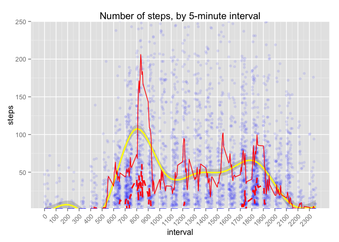
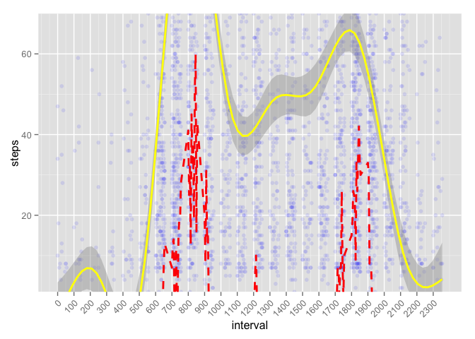
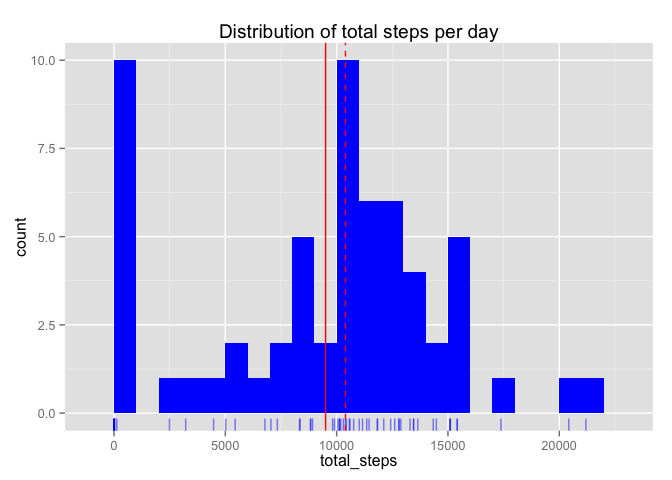
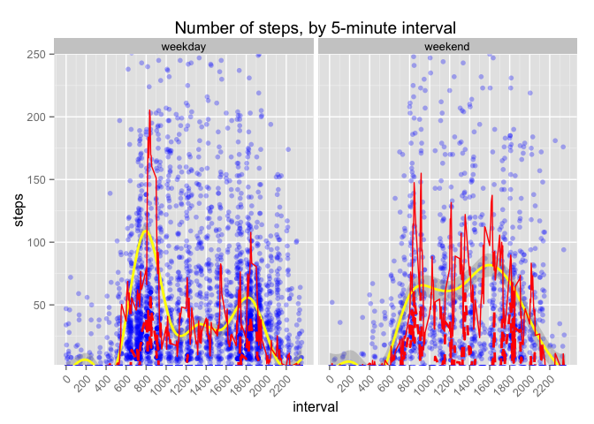

# Reproducible Research: Peer Assessment 1

## Loading and preprocessing the data


```r
library(ggplot2)        # for plotting
```

```
## Warning: package 'ggplot2' was built under R version 3.1.2
```

```r
options(digits = 2)     # only print to 2 digits
```

Note to self:  figure out how to update R.  

Read the data file, unzipping it if necessary.  


```r
filename <- 'activity.csv'
zipfilename <- 'activity.zip'
if (!file.exists(filename)) {
    unzip(zipfilename)
}
readdata <- read.csv(filename)
```

Data pre-processing: restrict to complete cases


```r
cc_data <- readdata[complete.cases(readdata), ]
```

A more careful analysis might also calculate `log(readdata$steps + 1)` to deal with the asymmetric interval distributions (discussed below) and turn date and interval into proper time codes.  

NB  The approach I take here never modifies the dataframe that is built directly from the CSV, at the expense of creating several daughter dataframes.  For instance, when we impute values to NA observations, we start by making a complete copy of the dataset.  This is only feasible because the dataset is relatively small (about 52k cells, 351kB on disc).  

## What is mean total number of steps taken per day?

1. We need to get the total number of steps on each date.  There's probably some R-iffic way to do this in one line using `sapply` or something, but my background is in Python and I always find clever R tricks too difficult to understand.  


```r
dates <- levels(cc_data$date) # NB this includes dates w/ 0 observations
daily_data <- data.frame(date = factor(), total_steps = numeric(), nobs = integer())
for (date in dates) {
    # Set a default value, just in case
    total_steps <- NA
    total_steps <- sum(cc_data[cc_data$date == date, 'steps'])
    nobs <- sum(!is.na(cc_data[cc_data$date == date, 'steps']))
    # Put the data into a temporary data frame
    new_row <- data.frame(date = date, total_steps = total_steps, nobs = nobs)
    # And append it to the bottom of daily_data
    daily_data <- rbind(daily_data, new_row)
}
# Convert daily_data$date to Date
daily_data$date <- as.Date(daily_data$date)
```

3. Calculate the mean and median.  We're doing this now so that we can include 
them in the histogram. 


```r
summary(daily_data$total_steps)
```

```
Daily total steps:     Min. 1st Qu.  Median    Mean 3rd Qu.    Max. 
Daily total steps:        0    6780   10400    9350   12800   21200
```


```r
mean_daily_steps <- mean(daily_data$total_steps)
mean_daily_steps
```

```
Mean daily total steps:  [1] 9354
```


```r
median_daily_steps <- median(daily_data$total_steps)
median_daily_steps
```

```
Median daily total steps:  [1] 10395
```

Note that `summary` gives slightly different results from `mean` and `median`.  Googling around turns up some discussions of differences in the way these functions handle significant digits, but that doesn't seem to be relevant here.  

2. Make a histogram of the total number of steps taken each day.  

One limitation of histograms is that the shape can vary with the bin width.  To avoid misinterpretations due to bin width choice, we include a rug, showing the location of every data point.  


```r
# In the base plotting system
#hist(daily_data$total_steps, breaks = 20)

# In ggplot
# Set bin width (units: number of steps)
binwidth <- 1000
# Define the plot's data and basic aesthetic
daily_data_plot <- ggplot(data = daily_data, aes(x = total_steps))
daily_data_plot + 
    # Histogram
    geom_histogram(binwidth = binwidth, fill='blue') + 
    # Rug
    geom_rug(color = 'blue', alpha = .5) +
    # Mean
    geom_vline(aes(xintercept = mean_daily_steps), color='red') +
    # Median
    geom_vline(aes(xintercept = median_daily_steps), color='red', linetype='dashed') +
    # Title
    ggtitle('Distribution of total steps per day')
```

 

Solid red vertical line indicates the mean (9354.23), dashed red vertical line indicates the median (10395).  

## What is the average daily activity pattern?

1. "Make a time series plot (i.e. `type = "l"`) of the 5-minute interval (x-axis) and the average number of steps taken, averaged across all days (y-axis)"

As I read these instructions, the x-axis will be an interval $i$ (e.g., 1200) and the y-value will be the mean $\bar{s}_i = \frac{1}{D} \sum_{d} s_{i,d}$, where $d$ indexes the days, $D$ is the total number of days (that have an observation at $i$), and $s_{i,d}$ is the number of steps at interval $i$ on day $d$.  

However, visual inspection indicates fat right tails for many intervals:  there are 308 observations of more than 500 steps.  (500 steps in 5 minutes is 100 steps per minute or 1.67 steps per second.  180 steps per minute, or 3 steps per second, is considered an appropriate running pace for serious runners.)  At the same time, the number of steps is bounded on the left at 0.  Since the mean can be a misleadingly high measure of central tendency with these kinds of distributions, we plot every observation in the dataset, and look for the central tendency using the mean, median, and a GAM estimate.  


```r
# Set upper and lower bounds for the y-axis
ylim <- c(2, 250)
# Define the data and aesthetic, and plot the individual observations
daily_pattern_plot <- ggplot(data = cc_data, 
                             aes(x = interval, y = steps)) + 
        geom_point(alpha = 0.1, color='blue') +
# We'll also add x ticks every hour, and tilt them for legibility
        scale_x_continuous(breaks = seq(0, 2300, 100)) +
        theme(axis.text.x = element_text(angle = 45, hjust = 1))
# Add a GAM estimation
dpp_smoother <- stat_smooth(size=1, color='yellow')
# Add the mean and median plots
dpp_mean <- stat_summary(fun.y = mean, geom='line', color='red')
dpp_median <- stat_summary(fun.y = median, geom='line', color='red', linetype='dashed', 
                           size=1)
# When we finally display the plot, restrict the y axis and add a title
daily_pattern_plot + dpp_smoother + 
    dpp_mean + 
    dpp_median + 
    coord_cartesian(ylim=ylim) + 
    ggtitle('Number of steps, by 5-minute interval')
```

 

Observations with steps > 250 not shown here but used in plot calculations.  Yellow curve:  GAM estimate with 95% confidence interval.  Red solid curve: mean.  Red dashed curve: median. 


```r
# Calculating the mean and median, for use outside of ggplot: 
# First, identify all the "levels" in cc_data$interval.  
# Since this column is an integer, not a Factor, use `unique`
intervals <- unique(cc_data$interval)
# Because of the very long right tail, we'll calculate both the mean and median
interval_data <- data.frame(interval = integer(), mean_steps = numeric(), 
                            median_steps = numeric())
for (interval in intervals) {
    mean_steps <- NA        # set default values
    median_steps <- NA
    mean_steps <- mean(cc_data[cc_data$interval == interval, 'steps'])
    median_steps <- median(cc_data[cc_data$interval == interval, 'steps'])
    new_row <- data.frame(interval = interval, mean_steps = mean_steps, 
                          median_steps = median_steps)
    interval_data <- rbind(interval_data, new_row)
}
```

Over 75% of interval medians are equal to 0:  


```r
summary(interval_data$median_steps)
```

```
##    Min. 1st Qu.  Median    Mean 3rd Qu.    Max. 
##       0       0       0       4       0      60
```

This means, for the vast majority of intervals, on most days the research subject takes 0 steps during that interval.  Of course, there are many observations of more than 0 steps!  The problem is that the research subject is not active during the same 5-minute intervals each day.  A coarser measuring interval — say, 1 hour — might therefore be more useful.  

Inspecting the plot, the median number of steps is noticeably greater than 0 during two parts of the day: roughly (a) from 6:30am to 9:15am and (b) from 5pm to 7:15pm.  Note that these correspond to the two highest local maxima of the GAM smoothing.  The mean is much messier, though its global max is also in interval (a).  


```r
# Plot again, but leave out the mean, and restrict y further
daily_pattern_plot + dpp_median + dpp_smoother + coord_cartesian(ylim = c(1, 70))
```

 

2. The time indices for the maximum value for mean and median are quite close: 


```r
interval_data[which.max(interval_data$median_steps), 'interval']
```

```
Maximum median at  [1] 845
```

```r
interval_data[which.max(interval_data$mean_steps), 'interval']
```

```
Maximum mean at  [1] 835
```


## Imputing missing values

1. In the full dataset, there are 15264 complete cases and 2304 incomplete cases (13.11%).  The analysis so far as used only the complete cases.  

2. In a real analysis, the imputation strategy would be based on the goals of the analysis, and the research project more broadly, as well as our knowledge (or assumptions) about the data collection process.  If we think that the missing data are genuinely random, then imputation will add, not reduce, bias.  

Every day has either 288 or 0 observations.  


```r
missing_data <- daily_data[daily_data$nobs == 0, 'date']
table(daily_data$nobs)
```

```
## 
##   0 288 
##   8  53
```

The days with 0 observations correspond to the incomplete cases in the interval-level datasets — no data is available at all for these days.  So we cannot impute missing values by, say, taking the mean value of the day.  

Since we will use the imputed data in the next question, where we are looking for differences between weekdays and weekends, we should compare which days of the week have missing data to the contingency table for days of the week in the overall study period.  


```r
table(weekdays(missing_data))
```

```
Days with missing data, by day of the week 
Days with missing data, by day of the week    Friday    Monday  Saturday    Sunday  Thursday Wednesday 
Days with missing data, by day of the week         2         2         1         1         1         1
```

```r
table(weekdays(daily_data$date))
```

```
Days of the study, by day of the week 
Days of the study, by day of the week    Friday    Monday  Saturday    Sunday  Thursday   Tuesday Wednesday 
Days of the study, by day of the week         9         9         8         8         9         9         9
```

We might want to use $\chi^2$ or related hypothesis test here.  However, using `chisq.test` would require adding Tuesday to the table for `missing_data` and ensuring the days of the week are in the same order in both tables.  If we do decide to impute missing data after all, we might use day-of-the-week interval medians, which will have a minimal effect on the results in the next question.  

3. But all that's more complicated than I have time for here.  So I'll just impute using the interval medians.  


```r
imputed_data <- readdata        # make a copy, so that we don't modify the read data
for (row in 1:nrow(imputed_data)) {
   if (is.na(imputed_data[row, 'steps'])) {
       interval <- imputed_data[row, 'interval']
       imputed_data[row, 'steps'] <- 
           interval_data[interval_data$interval == interval, 'median_steps']
   }
}
```

4. First, we'll build a version of `daily_data` with the newly-imputed data.  


```r
imputed_daily_data <- data.frame(date = factor(), total_steps = numeric(), nobs = integer())
for (date in dates) {
    # Set a default value, just in case
    total_steps <- NA
    total_steps <- sum(imputed_data[imputed_data$date == date, 'steps'])
    nobs <- sum(!is.na(imputed_data[imputed_data$date == date, 'steps']))
    # Put the data into a temporary data frame
    new_row <- data.frame(date = date, total_steps = total_steps, nobs = nobs)
    # And append it to the bottom of daily_data
    imputed_daily_data <- rbind(imputed_daily_data, new_row)
}
# Convert $date to Date
imputed_daily_data$date <- as.Date(imputed_daily_data$date)
```

Calculate mean and median. 


```r
summary(daily_data$total_steps)
```

```
Daily total steps:     Min. 1st Qu.  Median    Mean 3rd Qu.    Max. 
Daily total steps:        0    6780   10400    9350   12800   21200
```

```r
summary(imputed_daily_data$total_steps)
```

```
Daily total steps:     Min. 1st Qu.  Median    Mean 3rd Qu.    Max. 
Daily total steps:       41    6780   10400    9500   12800   21200
```


```r
imputed_mean_daily_steps <- mean(imputed_daily_data$total_steps)
mean_daily_steps
```

```
Mean daily total steps:  [1] 9354
```

```r
imputed_mean_daily_steps
```

```
Mean daily total steps:  [1] 9504
```


```r
imputed_median_daily_steps <- median(imputed_daily_data$total_steps)
median_daily_steps
```

```
Median daily total steps:  [1] 10395
```

```r
imputed_median_daily_steps
```

```
Median daily total steps:  [1] 10395
```

And finally, plot the histogram. This uses the same code as with `daily_data` above, just with the imputed dataset.  


```r
# In ggplot
# Set bin width (units: number of steps)
binwidth <- 1000
# Define the plot's data and basic aesthetic
imputed_daily_data_plot <- ggplot(data = imputed_daily_data, aes(x = total_steps))
daily_data_plot + 
    # Histogram
    geom_histogram(binwidth = binwidth, fill='blue') + 
    # Rug
    geom_rug(color = 'blue', alpha = .5) +
    # Mean
    geom_vline(aes(xintercept = imputed_mean_daily_steps), color='red') +
    # Median
    geom_vline(aes(xintercept = imputed_median_daily_steps), color='red', 
               linetype='dashed') +
    # Title
    ggtitle('Distribution of total steps per day')
```

 

## Are there differences in activity patterns between weekdays and weekends?

1. Create a new factor variable in the dataset with two levels – “weekday” and “weekend” indicating whether a given date is a weekday or weekend day. 


```r
weekend <- function (date) {
    # Returns True iff date is a Saturday or Sunday
    daystring <- weekdays(as.Date(date))
    (daystring == 'Saturday') | (daystring == 'Sunday')
}

imputed_data$weekend <- factor(ifelse(weekend(imputed_data$date), 
                                      'weekend', 'weekday'), 
                          ordered = FALSE)
# daily_data$weekend <- factor(ifelse(weekend(daily_data$date), 'weekend', 'weekday'), 
#                           ordered = FALSE)
```

2. This is identical to the first question of "What is the average daily activity pattern?," with the addition of the "weekday" and "weekend" factors.  


```r
# This is ridiculously easy in ggplot
# All we really need to do is add a group aesthetic to the daily_pattern_plot 
# definition
weekday_pattern_plot <- ggplot(data = imputed_data, 
                             aes(x = interval, y = steps, group = weekend)) + 
        geom_point(alpha = 0.3, color='blue') +
        scale_x_continuous(breaks = seq(0, 2300, 200)) +
        theme(axis.text.x = element_text(angle = 45, hjust = 1))
# Then we can reuse the same stats — they'll pick up the group automatically — 
# plus a facet_wrap
weekday_pattern_plot + dpp_smoother + 
    dpp_mean + 
    dpp_median + 
    coord_cartesian(ylim=ylim) + 
    ggtitle('Number of steps, by 5-minute interval') +
    facet_wrap(~weekend, nrow=1)
```

 

Differences between weekdays and weekends are suggested most clearly by the GAM estimate:  Weekdays have two clear peaks, between 6am and 10am and then again between 4pm and 8pm.  Weekends have more-or-less even levels of activity from 8am to 8pm.  
